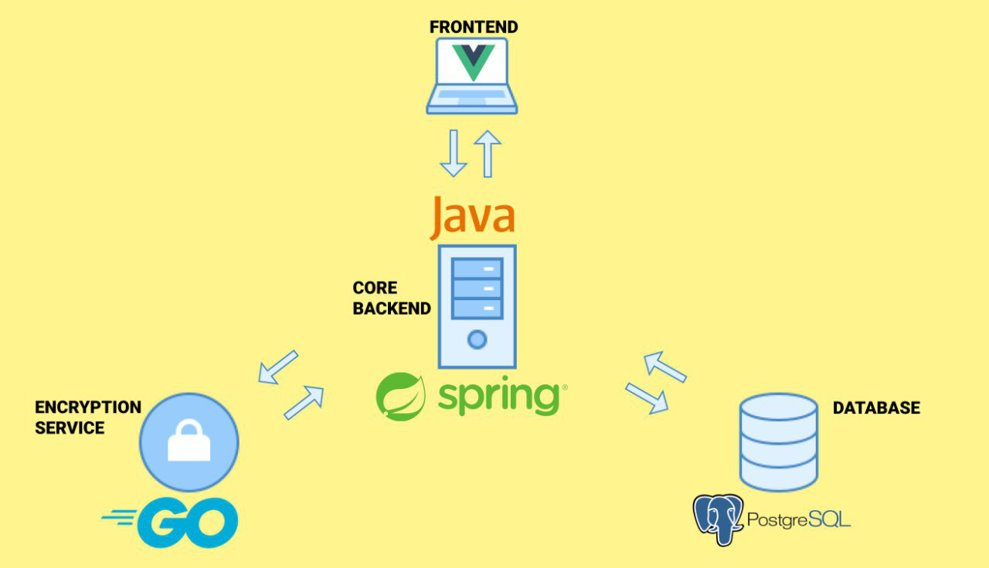
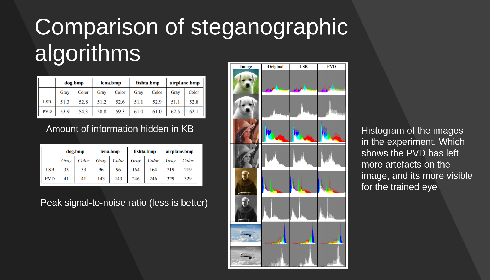
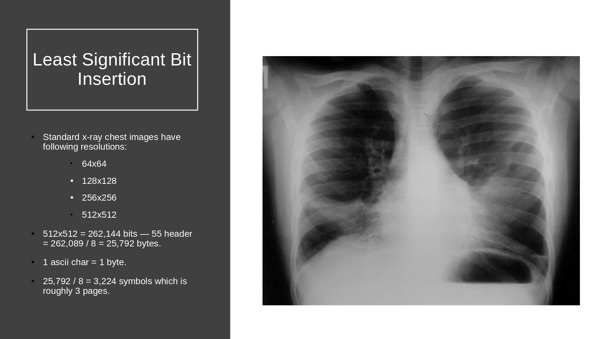

# Steganomed
## Steganomed is telemedical application, which allows doctors to exchange medical pics, which are encrypted by steganographical algorithm

### Application consists from 3 services:
- Core backend (this project)
- Encryption service (https://github.com/HimekoInaba/Steganomed-Encryption-Service)
- Frontend (https://github.com/HimekoInaba/Steganomed-Frontend)



### Comparison of algorithms suitable for BMP images


### How much data can be stored in standart images


### Deployment using docker
1) ```./gradlew build```
2) ```docker-compose up```
